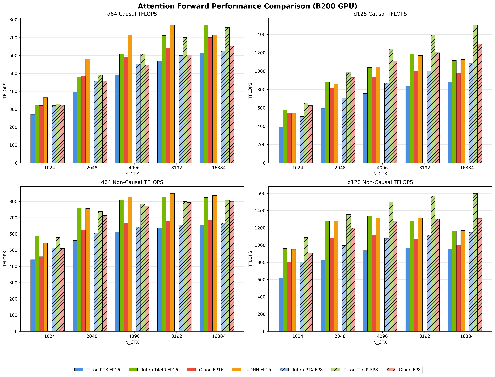
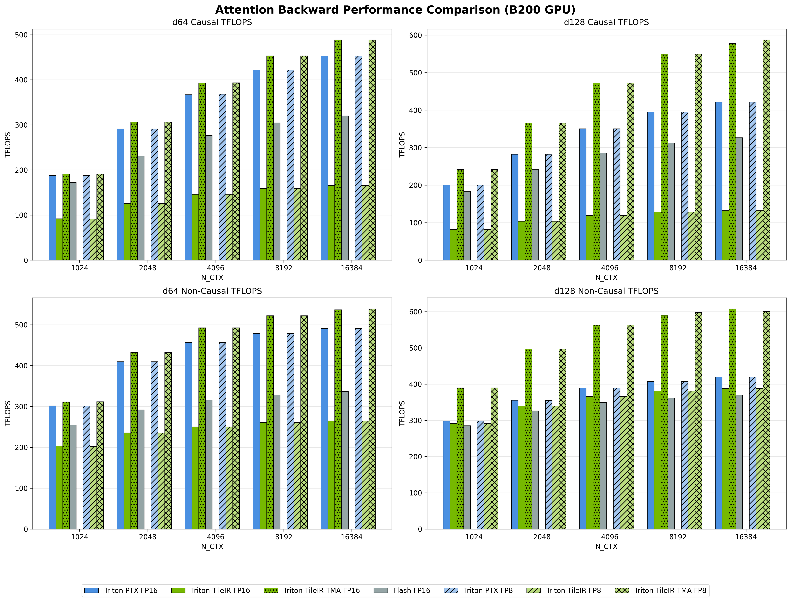

# Performance Tuning Tips for CUDA Tile IR Backend

This document provides a practical tutorial for optimizing Triton scripts to achieve better performance when running with the CUDA Tile IR backend.

## Autotune Configurations

### New Hints & Configs for CUDA Tile IR Backend

#### **occupancy** (Critical)

The **occupancy** hint accepts an integer N from 1 to 32, indicating that the programmer expects N active thread blocks to run simultaneously per SM. This hint is 1 by default and is worth tuning for many SIMT compute-intensive kernels.

#### Numerical Precision Options (approx & ftz)

Unlike the Triton PTX backend, the CUDA Tile IR Backend disables approx and ftz by default. Setting `TILEIR_ENABLE_APPROX=1` and `TILEIR_ENABLE_FTZ=1` can provide performance improvements in certain workloads (with precision degradation within acceptable ranges), such as **`attention`** and its variant kernels.

Note that the TileIR compiler (`tileiras`) shipping in CUDA 13.1 does not automatically optimize `exp.approx -> ex2 + mulf`.  For performance and precision parity with the Triton PTX backend, please explicitly rewrite `expOp` to use `ex2 + mulf` instead. 

#### opt-level

The default optimization level is currently `opt-level=3`. At this stage, adjusting this parameter is unnecessary.

### Existing Triton Hints

#### **num_ctas** (Critical)

Setting **num_ctas=2** is critical for dense dot-related workloads on specific hardware, for example, it enables 2CTA mode MMA on Blackwell architecture.

#### num_warps

The CUDA Tile IR Backend currently ignores the `num_warps` hint, leaving tileiras to determine the optimal number of warps automatically. Therefore, autotuning `num_warps` is unnecessary. While the default is 4, the tileiras compiler will analyze and decide the specific num_warps after optimization.

#### num_stages

Unlike the PTX backend, the CUDA Tile IR Backend treats the `num_stages` hint (whether per-kernel or per-loop) as a cost hint rather than a strict directive. This means a matmul kernel with `num_stages=3` won't necessarily have 3 stage buffers for pipelining. Instead, tileiras analyzes the impact of the `num_stages=3` operation from a whole program perspective and determines the optimal pipeline configuration.

Since `num_stages` is a cost semantic hint, it is strongly recommended to expand the tuning range of `num_stages` during autotune, especially for dot-related kernels, where larger values can be tried.

The compiler should generally avoid producing SMEM or TMEM out-of-memory errors solely due to varying `num_stages` (or other hints). If you encounter systematic failures on reasonable configs, please capture a minimal repro and report it.

#### warp_specialize

The CUDA Tile IR Backend does not consider this loop hint.

#### Manual Slicing

Manual slicing approaches (such as `EPILOGUE_SUBTILE` in `python/tutorials/09-persistent-matmul.py`) may not provide positive benefits for CUDA Tile IR Backend.

## Optimization Tips

- **CGA-Level Tile Representation**: The CUDA Tile IR Backend treats tiles as CGA-level representations. When autotuning `BLOCK_SIZE`, consider increasing the block size appropriately to avoid missing high-performance program solutions.

- **2CTA Mode**: When using 2CTA mode, experiment with relatively larger `BLOCK_SIZE` values.

- **TMA API Preference**: The TileIR compiler shipping in CUDA 13.1 has a known performance issue with the `tl.load` API (for example, running `03-matrix-multiplication.py` is 20%+ slower than when using the Triton PTX backend). It is recommended to use TMA APIs for all data loading scenarios. The tileiras compiler will automatically fall back to alternative instructions when TMA requirements are not met.

## Performance Benchmarks on B200(1000W)

```bash
sudo nvidia-smi -i 0 -pm 1; sudo nvidia-smi -i 0 -pl 1000; sudo nvidia-smi -i 0 -lgc 1800
```

### Fused Attention (06-fused-attention.py)

> For Triton PTX backend, choose the best one in warp_specialize={true, false}. For CUDA Tile IR Backend, enable approx & ftz





### Persistent Matmul (09-persistent-matmul.py) 

> TFLOPS by Proton

#### NVIDIA PTX backend 

| Kernel Name | K=512 | K=1024 | K=1536 | K=2048 | K=2560 | K=3072 | K=3584 | K=4096 | K=4608 | K=5120 | K=5632 | K=6144 | K=6656 | K=7168 | K=7680 | K=8192 |
|---|---|---|---|---|---|---|---|---|---|---|---|---|---|---|---|---|
| matmul_kernel | 410.535 | 485.939 | 508.868 | 523.959 | 523.860 | 517.353 | 509.405 | 503.433 | 457.957 | 462.662 | 466.334 | 467.583 | 465.737 | 468.807 | 467.914 | 474.498 |
| matmul_kernel_descriptor_persistent | 439.707 | 500.525 | 531.170 | 553.606 | 564.037 | 556.934 | 559.873 | 524.308 | 515.534 | 519.169 | 520.699 | 520.417 | 552.134 | 521.023 | 518.283 | 516.987 |
| matmul_kernel_descriptor_persistent_ws | 424.881 | 492.736 | 536.487 | 554.557 | 566.113 | 566.654 | 560.431 | 525.796 | 523.949 | 523.864 | 525.539 | 524.556 | 519.728 | 524.902 | 521.294 | 520.290 |
| matmul_kernel_persistent | 437.177 | 490.192 | 505.463 | 526.356 | 495.549 | 502.120 | 492.795 | 509.629 | 464.547 | 492.138 | 461.204 | 473.903 | 456.420 | 459.663 | 482.381 | 476.654 |
| matmul_kernel_tma | 453.171 | 510.479 | 540.693 | 554.571 | 550.412 | 547.197 | 537.709 | 504.863 | 495.738 | 495.422 | 501.529 | 500.631 | 502.919 | 504.600 | 503.772 | 505.822 |
| matmul_kernel_tma_persistent | 457.762 | 526.818 | 541.512 | 562.336 | 569.793 | 552.891 | 560.229 | 509.174 | 516.811 | 549.679 | 522.550 | 519.533 | 515.688 | 539.053 | 512.148 | 509.444 |
| matmul_kernel_tma_persistent_ws | 443.856 | 519.320 | 553.608 | 574.412 | 578.525 | 579.166 | 569.080 | 534.047 | 532.451 | 532.137 | 533.668 | 530.485 | 554.178 | 524.998 | 522.821 | 550.687 |
| matmul_kernel_tma_ws | 421.550 | 502.304 | 537.107 | 551.843 | 551.784 | 541.865 | 532.079 | 495.340 | 495.921 | 494.918 | 492.878 | 496.289 | 502.044 | 503.006 | 501.350 | 504.051 |

#### CUDA Tile IR Backend

| Kernel Name | K=512 | K=1024 | K=1536 | K=2048 | K=2560 | K=3072 | K=3584 | K=4096 | K=4608 | K=5120 | K=5632 | K=6144 | K=6656 | K=7168 | K=7680 | K=8192 |
|---|---|---|---|---|---|---|---|---|---|---|---|---|---|---|---|---|
| matmul_kernel | 372.083 | 478.821 | 515.220 | 523.229 | 536.626 | 538.881 | 540.379 | 540.189 | 536.922 | 496.812 | 527.281 | 527.333 | 545.069 | 551.638 | 556.737 | 546.898 |
| matmul_kernel_descriptor_persistent | 449.608 | 566.495 | 592.396 | 615.399 | 621.022 | 625.198 | 633.241 | 632.614 | 633.009 | 629.261 | 632.138 | 637.709 | 641.277 | 644.160 | 648.690 | 648.044 |
| matmul_kernel_descriptor_persistent_ws | 448.865 | 566.048 | 592.297 | 616.102 | 620.858 | 628.390 | 637.610 | 640.445 | 634.553 | 631.684 | 647.245 | 639.895 | 641.622 | 645.320 | 650.257 | 646.576 |
| matmul_kernel_persistent | 386.227 | 472.954 | 502.894 | 512.529 | 523.132 | 530.562 | 535.570 | 538.549 | 538.180 | 538.355 | 541.091 | 541.664 | 547.022 | 549.228 | 548.273 | 552.914 |
| matmul_kernel_tma | 447.497 | 557.842 | 579.246 | 584.937 | 579.374 | 562.360 | 590.016 | 596.886 | 605.709 | 574.770 | 578.394 | 608.760 | 612.595 | 615.713 | 616.805 | 618.996 |
| matmul_kernel_tma_persistent | 450.121 | 566.328 | 594.972 | 614.759 | 620.405 | 628.140 | 635.045 | 635.619 | 630.554 | 629.911 | 646.355 | 636.326 | 639.891 | 645.985 | 644.748 | 644.186 |
| matmul_kernel_tma_persistent_ws | 442.042 | 566.433 | 591.798 | 616.341 | 621.496 | 628.013 | 636.439 | 633.790 | 633.202 | 629.759 | 631.215 | 630.826 | 641.347 | 643.391 | 649.245 | 646.864 |
| matmul_kernel_tma_ws | 446.199 | 557.764 | 581.963 | 588.196 | 580.131 | 558.987 | 590.458 | 599.535 | 607.182 | 608.649 | 611.659 | 611.689 | 614.381 | 617.276 | 619.827 | 620.500 |
